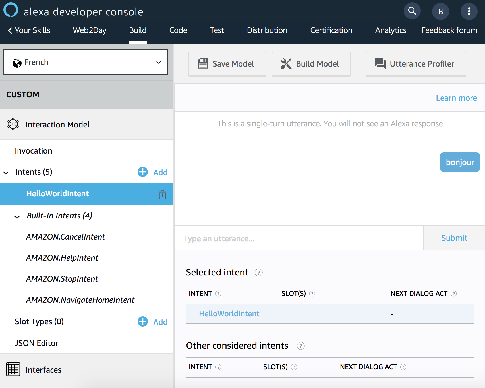

# Création d'une Custom Skill

> ## Objectif : Vous allez créer une Custom Skill entièrement depuis la [Console de Développement Alexa en ligne](https://developer.amazon.com/alexa/console/ask) en utilisant Alexa-Hosted.

## Temps nécessaire : 5 minutes

## Description

[Alexa-Hosted](https://developer.amazon.com/docs/hosted-skills/build-a-skill-end-to-end-using-an-alexa-hosted-skill.html) provisionne pour vous des resources Cloud sur AWS pour gérer votre backend sans avoir besoin de compte AWS. Vous avez accès à une fonction AWS Lambda pour héberger votre code, un bucket Amazon S3 pour gérer la persistance et les fichiers médias ainsi
qu'à Amazon Cloudwatch pour accéder à vos logs. Un éditeur de code web vous permet de modifier le code backend en Node.js et de le déployer directement sur AWS Lambda.

## Etapes

1. Connectez-vous à [Alexa Developer Console](https://developer.amazon.com/alexa/console/ask) 

2. Créez une nouvelle Skill de type `Custom` en langue française en mode `Alexa-Hosted`. 

>  **Note**: une ou deux minutes sont nécessaires pour laisser à Alexa le temps de provisionner les resources AWS pour héberger votre backend.
 
3. Allez sur l'onglet `Build` et mettez à jour l'intention `HelloWorldIntent` avec des utterances (phrases d'exemples) en français. (Par défaut, le template de modèle d'interaction est crée en anglais).

**Remarquez les intentions AMAZON** déjà présentes dans la section `intents` de votre modèle d'interaction. Ces intentions sont obligatoires dans une Skill Custom :
- A tout moment, un utilisateur doit pouvoir stopper la Skill : AMAZON.StopIntent
- A tout moment, un utilisateur peut annuler une opération dans la Skill : AMAZON.CancelIntent (quand il n'y a pas de notion d'annulation nécessaire dans la Skill, vous pouvez la considérer identique à un AMAZON.StopIntent)
- A tout moment, un utilisateut peut demander de l'aide : AMAZON.HelpIntent.
Chacune de ces intentions a déjà été entrainé par Alexa et vous n'avez pas besoin de fournir des utterances d'exemples. C'est ce qu'on appelle les “built-in intents. 

4. Sauvegardez votre modèle d'interaction

>  **Important**: La console Developer Alexa ne fait pas de sauvegarde automatique des changements effectués. N'oubliez de sauvegarder vos modifications avant de fermer votre browser !

5. Vérifiez le nom d'invocation de votre Skil. Vous pouvez choisir ce que vous souhaitez. Si vous êtes en manque d'inspiration, vous pouvez choisir `web to day`

> **Note :** Pour qu'un utilisateur commence à interagir avec votre Custom Skill, il doit l'invoquer explicitement en mentionnant le nom d'appel de la Skill dans l'utterance qu'il mentionne. C'est ce qu'on appelle le nom d'invocation (invocation name). Cela peut être soit un nom (comme une marque) ou bien une suite de mots.

6. Sauvegardez votre modèle d'interaction

7. Pour être utilisable, le modèle d'interaction a besoin d'être builder. Sans cette étape, vous ne pourrez pas tester votre Skill.

> **Note :** Dès que vous faites une modification que vous souhaitez tester, n'oubliez jamais de builder votre modèle d'interaction. 

8. Testez votre modèle d'interaction en utilisant le profileur d'utterances. Cliquez sur le boutton 

Et vous pouvez entrer n'importe quelle utterance comme si vous étiez en train d'intéragir avec votre Skill. Le profileur mentionnera l'intention selectionnée en fonction de l'utterance écrite.

## Bravo, vous venez de créer votre première Skill et modifier son modèle d'intéraction. Nous allons maintenat regarder le code traitant les requêtes envoyées par le Service Alexa.
## Suivant : [Backend de la Skill](./02-backend.md)