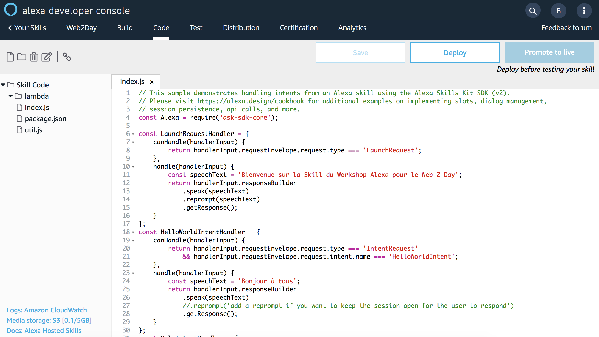

# Backend de votre Skill

> ## Objectif : Vous allez modifier votre code backend  d'Alexa

## Temps nécessaire : 5 minutes

## Description

Les échanges entre votre backend et Alexa se fait par des requêtes HTTPS de type POST avec un body en JSON. Le body contient les paramètres nécessaires pour que votre code puisse générer une réponse au format JSON compatible avec Alexa. Il existe différentes types de requêtes qu'Alexa peut envoyer à votre backend en fonction de la manière dont les utilisateurs parlent avec votre Skill. 

Pour vous simplifier le traitement des requêtes depuis votre backend (e.g vous éviter d'avoir à gérer la sérialisation et la désérialisation des requêtes et réponses), Alexa propose un SDKs pour développer en Node.js, Java ou Python. Sur ces trois langages de programmation, les concepts et la logique du SDK est la même. Le SDK fonctionne sur des classes de modèle plutôt que sur les requêtes et réponses Alexa en JSON natives. Ces classes de modèle sont générées à l'aide des schémas JSON de requête et réponse.

En utilisant le SDK Alexa, vous allez définir des `Handlers` qui consistent chacun en deux méthodes à implémenter: une fonction `canHandle()` qui définit les événements auxquels le gestionnaire répond, et une fonction `handle()` qui contient la logique de la réponse du gestionnaire. Le routing des requêtes est basé sur les conditions définies dans la fonction canHandle.

``` javascript
const monHandler = {
    canHandle(handlerInput) {
        // Est-ce que je peux traiter la requête ?
        // renvoie un boolean

    }
    handle(handlerInput) {
        // OK, je traite la requête et renvoie un prompt à Alexa 
        // renvoie le JSON de sortie à Alexa
    }
};
```

Dans le cas de Alexa-Hosted, un backend par défaut (avec des prompts anglais) basé sur le SDK Alexa est fourni par défaut.

> **Note :** Alexa-Hosted supporte pour le moment Node.js

## Etapes

1. Allez sur l'onget `Code`, observer les différents `Handlers` et changer les prompts (réponses de votre Skill) en français. (Par défaut, le template de code est crée en anglais).



2. Sauvegardez vos changements


>  **Important**: La console Developer Alexa ne fait pas de sauvegarde automatique des changements effectués. N'oubliez de sauvegarder vos modifications avant de fermer votre browser !

3. Déployez votre code


> **Important**: Dès que vous faites une modification que vous souhaitez tester, n'oubliez jamais de déployer votre code. 

## Suivant : [Testez votre Skill](./03-test.md)