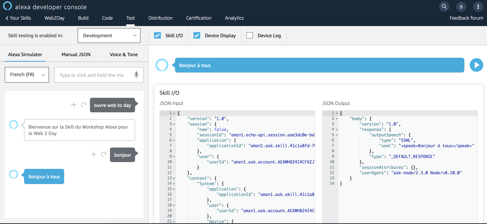

# Skill Testing

> ## Objectif : Vous allez tester votre Skill depuis le Simulateur de test disponible depuis la console de développement Alexa

## Temps nécessaire : 5 minutes

## Description

La Console de Développement Alexa propose un simulateur en ligne pour tester votre Skill sans avoir besoin d'utiliser un appareil Alexa-Enabled. En utilisant ce simulateur, vous avez la possibilité d'écrire ce que vous mentionnerez à Alexa ou bien de parler avec le simulateur. Lorsque vous écrivez vos utterances dans le simulateur, évitez les typos (typiquement oubli d'accent) pour que la reconnaissance naturel du langage d'Alexa puisse être la plus précise possible.

Sur les Custom Skills, vous verrez le JSON de la requête envoyée par Alexa à votre Skill ainsi que le JSON de sortie de votre Skill. Dans le cas où votré réponse contient un template APL (multimodal)

> Tip : Vous pouvez gagnez du temps en utilisant l'[Extension Chrome Jovo](https://github.com/jovotech/ask-console-chrome-extension) pour garder les utterances les plus courantes et y accéder en un click.

## Etapes

1. Allez à l'onget `Test` and activez le testing de votre Skill en mode ```Development```

> Note : Si vous utilisez le même compte Amazon pour le portail développeur et la configuration de vos appareils Alexa-Enabled, toute Skill que vous développerez sera accessible sur tous les appareils enregistrés sur votre compte dès cette étape sans avoir besoin de la publier.


2. Testez votre Skill en commencant par une invocation ```ouvre web to day```. Observez la réponse d'Alexa, les JSONs en entrées et en sortie.



## Vous venez de créer et tester votre Skill en moins de 15 minutes.
## Suivant : [Ajout d'une intention](./04-use-ssml.md)