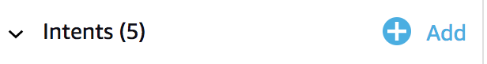
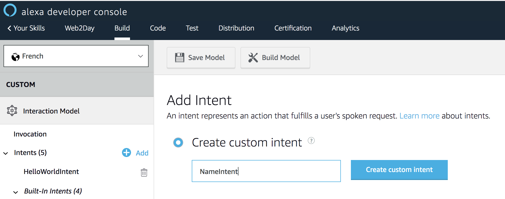
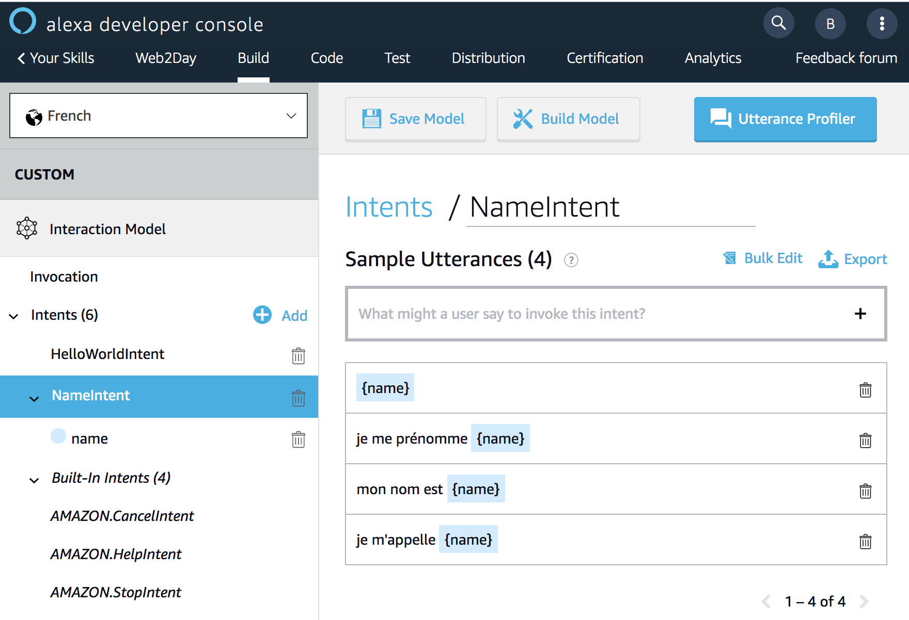
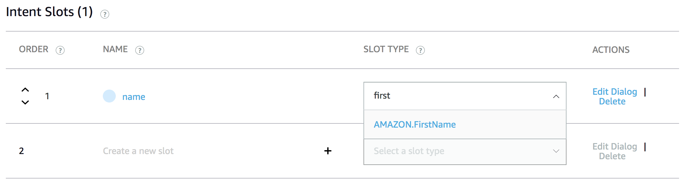
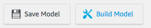

# Ajouter une intention à votre Skill

> ## Objectif : Rajouter une intention pour récupérer le prénom de l'utilisateur

## Temps nécessaire : 10 minutes

## Description

On souhaite connaître le prénom de l'utilisateur afin de pouvoir le saluer plus personnellement. Au lancement de la Skill, nous allons rajouter une questions à notre prompt d'accueil pour demander le prénom de l'utilisateur. Pour capturer cette réponse, nous allons ajouter une intention dans notre modèle d'interaction. Cette intention, à la différence de HelloWorldIntent, contient une variable, aussi appelée “entité” ou “slot”. Comme toute variable, elle a un nom (name) et un type AMAZON.FirstName. Une fois cette intention définie, nous allons ajouter un `Handler` pour traiter les requêtes envoyées par le service Alexa sur cette intention dans notre code.

> **Note : ** Alexa propose aussi une API ([Customer Profile API](https://developer.amazon.com/docs/custom-skills/request-customer-contact-information-for-use-in-your-skill.html)) pour qu'une Skill puisse accéder aux informations de contact (nom, prénom, téléphone, mail) d'un utilisateur si et seulement si l'utilisateur le consent.

## Etapes

1. Allez à l'onget `Build` et rajouter une intention appelé `NameIntent`




2. Ajoutez des exemples d'utterances pour qu'Alexa puisse mapper l'utterance d'un utilisateur à cette intention



> **Important**: Ici, on veut reconnaître un prénom, qui sera une valeur donnée par l'utilisateur, on utilise donc un slot. Un slot s'écrit dans une utterance entre accolades `{name}`.


3. Définissez le type de slot pour le paramètre `{name}`. 

Sur l'intention `NameIntent`, une fois que l'on rajouté le slot `{name}`, il va apparaître dans la liste des paramètres (`Intent Slots`) de cette intention. Pour reconnaître des prénoms, nous allons utiliser le type prédéfini `AMAZON.FirstName`. Ce type dispose déjà d'un catalogue de valeurs qui définissent la manière dont les données de ce slot sont reconnues et traitées.



4. Sauvegardez votre modèle d'interaction


>  **Important**: Vous ne pourrez pas faire une sauvegarde de votre modèle d'interaction avant de définir un type à votre slot.

5. Pour être utilisable, le modèle d'interaction a besoin d'être builder. Sans cette étape, vous ne pourrez pas tester votre Skill.



> **Note :** Dès que vous faites une modification que vous souhaitez tester, n'oubliez jamais de builder votre modèle d'interaction. 

6. Allez à l'onget `Code` pour rajouter le code pour traiter les requêtes de cette nouvelle intention.

6-a Sur le handler `LaunchRequestHandler`, mettez à jour la propriété `speechText` pour rajouter la question pour poser la question du prénom de l'utilisateur.

Si la propriété `speechText` est définie comme une constante avec le mot-clé `const`, elle ne pourra pas être modifiée. Il faut d'abord changer le type de cette propriété en changeant le mot-clé `const` par `let`.

``` javascript
let speechText
```

Puis on va rajouter le texte suivant à la propriété `speechText` : 

``` javascript
speechText += ' Quel est votre prénom ?'
```

6-b Nous allons créer un nouvel Handler dédié à cette intention que l'on va appeler `NameIntentHandler` et rajouter dans le code :


``` javascript
const NameIntentHandler = {
    canHandle(handlerInput) {
        // Test pour savoir si je peux traiter les requêtes d'intention pour NameIntent
        // renvoie un boolean

    }
    handle(handlerInput) {
        // OK, je traite la requête et je récupère la slot et salue l'utilisateur.
        // renvoie le JSON de sortie à Alexa
    }
};
```

7. Mettez à jour la méthode `canHandle(handlerInput)` du nouvel handler `NameIntentHandler` pour traiter les requêtes de l'intention `NameIntent`

``` javascript
canHandle(handlerInput) {
    return handlerInput.requestEnvelope.request.type === 'IntentRequest'
        && handlerInput.requestEnvelope.request.intent.name === 'NameIntent';
}
```

8. Mettez à jour la méthode `handle(handlerInput)` du nouvel handler `NameIntentHandler` pour traiter les requêtes de l'intention `NameIntent`

``` javascript
handle(handlerInput) {
    const nameSlotValue = handlerInput.requestEnvelope.request.intent.slots.name.value;
    const speechText = `Bonjour, ${nameSlotValue} !`;
    return handlerInput.responseBuilder
        .speak(speechText)
        .getResponse();
}
```

9. Rajoutez votre Handler à la chaine des Handlers du SDK

Pour que le nouveau handler crée `NameIntentHanldler` puisse être pris en compte par le dispatcher de requêtes du SDK, il faut enregistrer celui-ci sur le dispatcher sinon il ne sera pas utilisé.

Localisez l'instance du SDK utilisée dans notre backend : `Alexa.SkillBuilders.custom()` et rajoutez le handler `NameIntentHandler` à la liste des handlers existant.

``` javascript
exports.handler = Alexa.SkillBuilders.custom()
    .addRequestHandlers(
        LaunchRequestHandler,
        HelloWorldIntentHandler,
        NameIntentHandler, // <-- ADD INTENT HANDLER HERE
        HelpIntentHandler,
        CancelAndStopIntentHandler,
        SessionEndedRequestHandler,
        IntentReflectorHandler)
```

> **Note :** la liste des handlers est ordonnée de telle sorte que le premier handler qui peut traiter la requête sera appelé qu'il existe un ou plusieurs handlers capables de traiter la même requête. Pensez donc à inscrire vos handlers du plus spécifique au plus général.

10. Sauvegardez vos changements


>  **Important**: La console Developer Alexa ne fait pas de sauvegarde automatique des changements effectués. N'oubliez de sauvegarder vos modifications avant de fermer votre browser !

11. Déployez votre code


> **Important**: Dès que vous faites une modification que vous souhaitez tester, n'oubliez jamais de déployer votre code. 

12. Allez à l'onglet `Test` pour tester cette nouvelle intention en invoquant votre Skill `ouvre web to day` puis en vous laissant guider dans ce que demande la Skill.


> **Important**: Dès que vous faites une modification que vous souhaitez tester, n'oubliez jamais de déployer votre code. 

## Suivant : [Ajouter la persistence](./06-add-persistence.md)