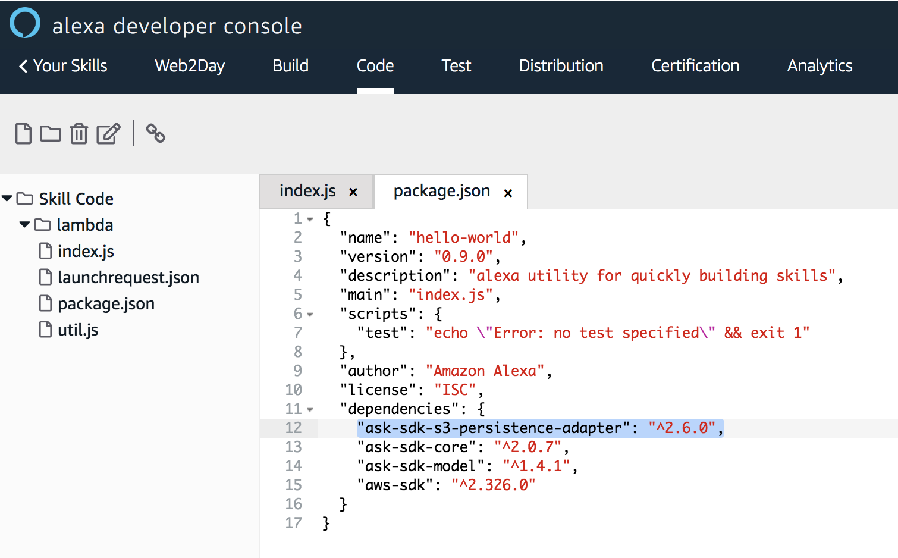

# Ajoutez la persistence long-terme

> ## Objectif : Vous allez utiliser les attributs de persistence du SDK Alexa pour vous rappelez d'informations mentionnées à votre Skill entre plusieurs sessions.

## Temps nécessaire : 8 minutes

## Description

Pour chaque nouvelle invocation de la Skill, si l'utilisateur a déjà spécifié son prénom, nous souhaitons le saluer en mentionnant son prénom. Sinon, on va lui demander son prénom et le stocker pour l'utiliser à nouveau dès que l'utilisateur invoque à nouveau la Skill. 
Cela veut dire que l'on souhaite se rappeler d'informations mentionnées par l'utilisateur entre plusieurs sessions de la Skill.

Une session pour votre Skill commence lorsqu'un utilisateur commence à interagir avec votre Skill en utilisant son nom d'invocation, et se termine lorsque la propriété `shouldEndSession` du JSON de sortie à la valeur `true` ou bien lorsque l'utilisateur ne réponds pas à un (re)-prompt. 

Pour mémoriser des données entre plusieurs sessions, vous devez enregistrer ces données sur un stockage persistant (e.g base de données ou fichier). La gestion des attributs de persistance est intégrée dans le SDK. Ils sont pris en charge par l'interface `attributesManager` qui expose les attributs que vous pouvez récupérer et mettre à jour dans les Handlers. Deux connecteurs sont fournis pour gérer la persistance long-terme: un pour Amazon S3 (service AWS de stockage objet) - [S3PersistenceAdapter](https://ask-sdk-for-nodejs.readthedocs.io/en/latest/Managing-Attributes.html#s3persistenceadapter) et un pour Amazon DynamoDB (service AWS de base de données non-relationnel) - [DynamoDbPersistenceAdapter](https://ask-sdk-for-nodejs.readthedocs.io/en/latest/Managing-Attributes.html#dynamodbpersistenceadapter).

Dans le cas de Alexa-Hosted, nous allons utiliser le bucket Amazon S3 mis à notre disposition comme couche de persistance.


## Etapes

1. Allez à l'onget `Code` et rajouuter la dépendence suivante dans le fichier `package.json` :

``` javascript
"ask-sdk-s3-persistence-adapter": "^2.0.0",
```



Il s'agit ici de référencer le connecteur Amazon S3 à utiliser par le SDK dans notre code.

2. Sauvegarder vos changements


3. Ouvrez le fichier `index.js` et ajouter la dépendance au connecteur Amazon S3 à utiliser par le SDK.

``` javascript
const persistenceAdapter = require('ask-sdk-s3-persistence-adapter');
```

Vous pouvez rajouter cette dépendance juste après la dépendance au SDK Alexa `'ask-sdk-core'`

4. Sur la méthode `handle` du handler `NameIntentHandler`, nous allons rajouter la sauvegarde du prénom de l'utilisateur en tant qu'attribut persistent.

La sauvegarde effectuée par le SDK via le connecteur Amazon S3 est une opération asynchrone. Pour s'assurer que l'appel puisse être correctement effectué, il faut mettre à jour la signature de la méthode `handle` en rajoutant le mot-clé `async` :

``` javascript
    async handle(handlerInput)
```

Pour effectuer la sauvegarde du prénom sur le bucket Amazon S3, nous allons passer par les attributs persistants disponible depuis l'interface `AttributesManager`. Ce gestionnaire d'attributs est accessible depuis le paramètre `handlerInput` de la méthode. Cela se traduit par les lignes de codes suivantes à rajouter dans la méthode `handle` après la propriété `speechText`.

``` javascript
const persistentAttributes = { 
        userName : nameSlotValue 
};
handlerInput.attributesManager.setPersistentAttributes(persistentAttributes)
await handlerInput.attributesManager.savePersistentAttributes()
```

5. Sur la méthode `handle` du handler `LaunchRequestHandler`, nous allons rajouter la récupération du prénom de l'utilisateur et l'ajouter au prompt de bienvenue.

La récupération effectuée par le SDK via le connecteur Amazon S3 est une opération asynchrone. Pour s'assurer que l'appel puisse être correctement effectué, il faut mettre à jour la signature de la méthode `handle` en rajoutant le mot-clé `async` :

``` javascript
    async handle(handlerInput)
```

Pour effectuer la récupération du prénom sur le bucket Amazon S3, nous allons passer par les attributs persistants disponible depuis l'interface `AttributesManager`. Ce gestionnaire d'attributs est accessible depuis le paramètre `handlerInput` de la méthode. Cela se traduit par la ligne de code suivante à rajouter dans la méthode `handle` après la propriété `speechText`.

``` javascript
// get persistent attributes
const persistentAttributes = await handlerInput.attributesManager.getPersistentAttributes() || {};
```

Nous allons maintenant mettre à jour le prompt d'acceuil pour utiliser le prénom de l'utilisateur s'il est connu. Si la propriété `speechText` est définie comme une constante avec le mot-clé `const`, il faut d'abord changer le type de cette propriété en changeant le mot-clé `const` par `let`.

On va rajouter la mentionner du prénom dans notre prompt de sortie lorsque celui-ci est connu sinon on posera toujours la question 'quel est votre prénom' dans notre prompt. Pour se faire nous allons changer la ligne de code ``` speechText += ' Quel est votre prénom ?';  ``` par les linges de code suivantes: 

``` javascript
if (persistentAttributes.userName){
        speechText += ` Ravie de vous revoir parmi nous ${persistentAttributes.userName} ! Dites-moi bonjour et je vous répondrais`;
} else {
        speechText += ' Quel est votre prénom ?'; 
}
```

6. Sauvegarder vos changements


>  **Important**: La console Developer Alexa ne fait pas de sauvegarde automatique des changements effectués. N'oubliez de sauvegarder vos modifications avant de fermer votre browser !

7. Déployez votre code


> **Important**: Dès que vous faites une modification que vous souhaitez tester, n'oubliez jamais de déployer votre code. 

8. Allez à l'onglet `Test` pour tester le rendu final du prompt par Alexa en invoquant votre Skill `ouvre web to day` 

## Suivant : [Ajouter la gestion des écrans](./08-apl.md)