# Ajout un écran à vos réponses (APL)

> ## Objectif : Utilisez Alexa Presentation Language ([APL](https://developer.amazon.com/docs/alexa-presentation-language/apl-overview.html)) pour créer un écran que vous allez rajouter dans votre Skill et renvoyer si la device de l'utilisateur possède un écran


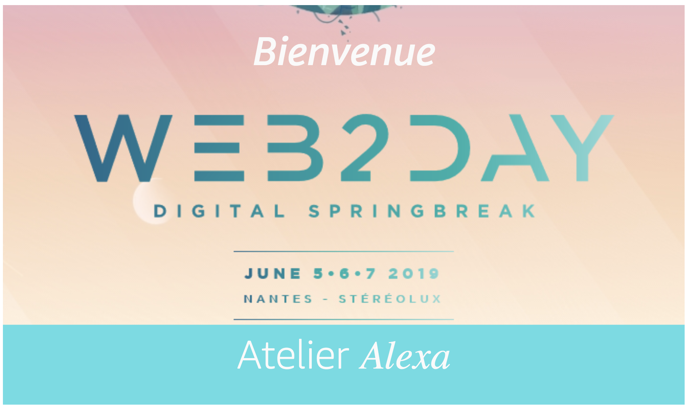

## Temps nécessaire : 15 minutes

## Description

Alexa propose un langage de présentation ([APL](https://developer.amazon.com/docs/alexa-presentation-language/apl-overview.html)) composée de primitives (container, image, text, video, scrollview) et des commandes permettant de créer des écrans pour les devices ([multimodales](https://developer.amazon.com/alexa-skills-kit/multimodal)) comme Echo Show ou Echo Spot par exemple. Les templates APL sont des fichiers de type JSON.

Classiquement pour ajouter APL à une Skill voici les différentes étapes du process que l'on va suivre : 

* Créez le template APL depuis l'éditeur disponible sur la console Alexa. 
* Ajoutez le template APL dans votre backend
* Activez l'interface APL 
* Détectez le support d'APL (aka si la device possède un écran) au runtime depuis votre code 
* Ajouter le template APL à votre réponse


## Etapes

1. Ouvrez l'éditeur de template APL : https://developer.amazon.com/alexa/console/ask/displays


2. Créez un nouveau template en sélectionant l'option `Start from Scratch`

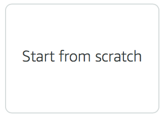

3. Nous allons écrire le template directement en JSON. Pour se faire, on va changer le mode d'édition.

Avant

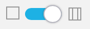

Après

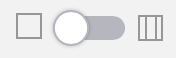


Cela fera apparaitre un editeur JSON dans la partie inférieur de l'éditeur avec le template par défaut suivant :

``` json
{
    "type": "APL",
    "version": "1.0",
    "theme": "dark",
    "import": [],
    "resources": [],
    "styles": {},
    "layouts": {},
    "mainTemplate": {
        "parameters": [
            "payload"
        ],
        "items": []
    }
}

``` 

* Le `theme` reflète la palette de couleurs de base utilisée sur l'appareil, les options ici sont `dark` ou `light`.

* La section `import` permet à votre document APL d'utiliser des styles, des ressources ou des documents APL externes.

* Les `ressources` sont des constantes utilisées pour dessiner du texte, des images et des layouts à l'écran. L'utilisation d'une constante nommée permet la réutilisation d'un document APL sur différents appareils en fournissant des ressources par typologie d'appareil.

* Les `styles` sont un ensemble de ressources dépendantes de l'état. Par exemple, le style flatButton définit la taille, le background, la couleur du texte, la couleur de la bordure, la largeur et le rayon de la bordure d'un type de bouton pour les états «normal», «enfoncé», «concentré» et «désactivé». Tous les composants APL ont une liste clairement documentée de propriétés stylées.

* Les `layouts` sont composées de composants visuels. Des portions du layout peuvent dépendre de la taille / forme de l'écran et peuvent inclure d'autres layouts

* La propriété `mainTemplate` est la mise en page principale du document APL qui comprendra les composants de base (container, frame, text, image, ...) ainsi que les layouts / styles / resources et import utilisés.

4. Copier-coller dans la partie JSON de l'éditeur de template APL, le document disponible [ici](https://developer.amazon.com/docs/alexa-presentation-language/apl-overview.html)

En inspectant la partie `mainTemplate` du JSON vous verez que le template est constitué d'un `container` principal contenant deux  éléments: un autre `container` contenant une image et un texte et une `frame` contenant un texte. Une `frame ` ne peut contenir qu'un seul élément alors qu'un `container` peut en contenir plusieurs.

``` 
Container
    |-- Container
            |-- Text
            |-- Image
    |-- Frame
        |-- Text

``` 

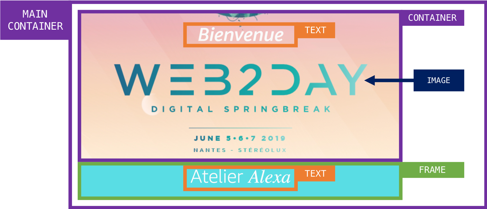

4. Allez sur l'onget `Build` pour rajouter l'interface `APL`

Selectionnez `Interfaces` depuis la liste des options disponibles sur la partie gauche de votre écran

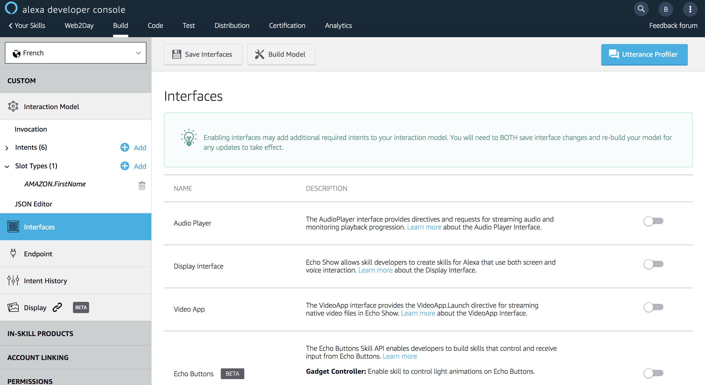

Activez l'interface `APL`

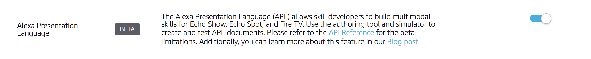

Sauvegardez les modifications d'interface

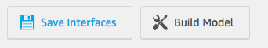

5. Allez sur l'onget `Test` pour rajouter votre template `APL` dans le backend.

Cliquez sur l'icône de création d'un nouveau fichier et rajoutez un fichier nommé `launchrequest.json` qui contiendra le template APL que vous venez d'éditer.

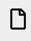
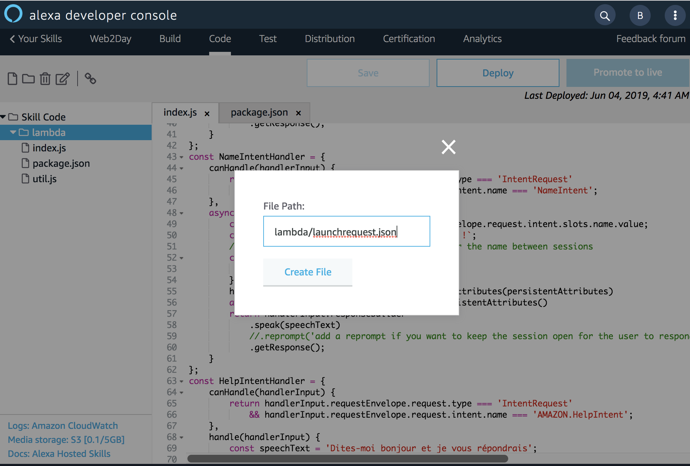

> **Note:** N'oubliez pas de copier-coller le contenu de l'editeur APL dans le nouveau fichier créé `launchrequest.json`
 
6. Ouvrez le fichier `index.js` et ajoutez la fonction de détection d'APL dans le code

``` javascript
function supportsAPL(handlerInput) {
  const supportedInterfaces = handlerInput.requestEnvelope.context.System.device.supportedInterfaces;
  const aplInterface = supportedInterfaces['Alexa.Presentation.APL'];
  return aplInterface != null && aplInterface != undefined;
}
``` 

Cette fonction sera utilisée pour savoir s'il est possible d'ajouter le template APL à la réponse de la Skill.
Dans la requête envoyée par Alexa, si l'appareil de l'utilisateur possède un écran alors cette information sera disponible sur la propriété `context.System.device.supportedInterfaces` du JSON d'entrée.


7. Ajoutez le document APL dans la réponse de la Skill

Toujours dans le fichier `index.js`, on va modifier la méthode `handle(handlerInput)` du handler `LaunchRequestHandler` pour rajouter le template APL si la device de l'utilisateur le supporte. Pour afficher un document APL sur la device, Alexa attends dans le JSON de sortie une directive APL de type `RenderDocument` avec le template entier à afficher. Avant de retourner la réponse à Alexa, on va rajouter les lignes de codes suivantes (à insérer après les modifications sur la propriété `speechText`) :

``` javascript
if (supportsAPL(handlerInput)) {
    builder.addDirective({
        type: 'Alexa.Presentation.APL.RenderDocument',
        version: '1.0',
        document: require('./launchrequest.json'),
        datasources: {}
    })
}
``` 

8. Sauvegardez vos changements


>  **Important**: La console Developer Alexa ne fait pas de sauvegarde automatique des changements effectués. N'oubliez de sauvegarder vos modifications avant de fermer votre browser !

9. Déployez votre code


> **Important**: Dès que vous faites une modification que vous souhaitez tester, n'oubliez jamais de déployer votre code. 

10. Allez à l'onglet `Test` pour tester le rendu final de l'écran en invoquant votre Skill `ouvre web to day` 

> **Note :** Vous pouvez tester le rendu sur différentes taille d'écran depuis le Simulateur de Test

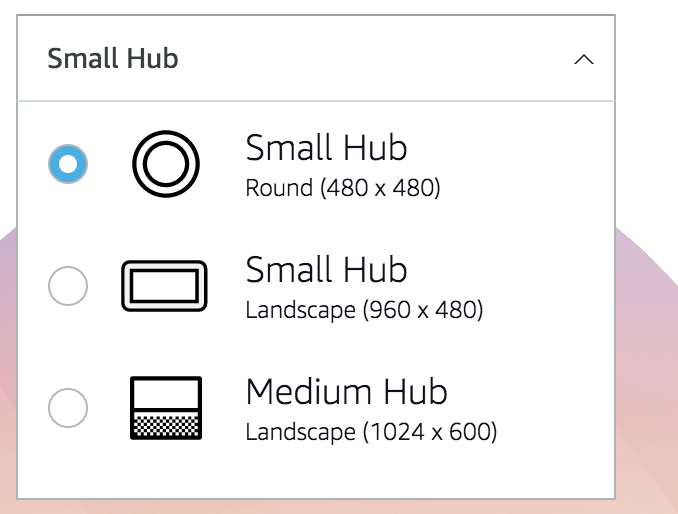
